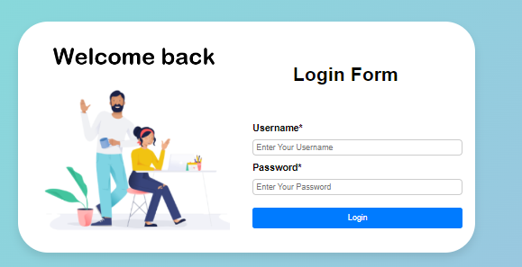
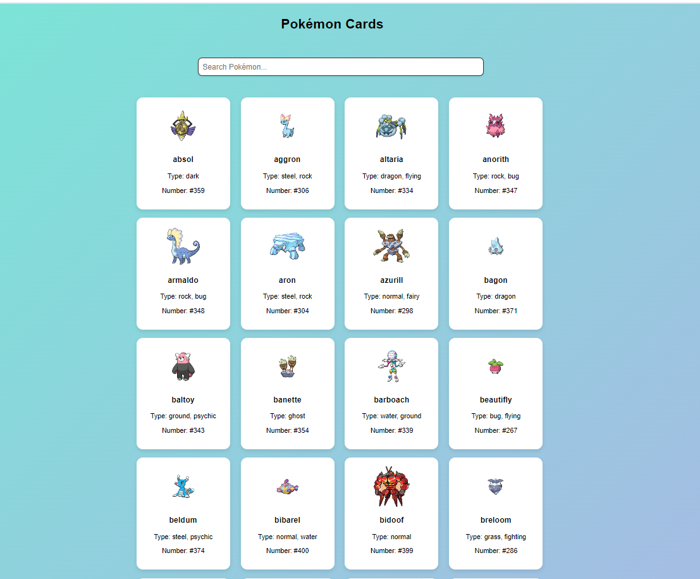

# Getting Started with Create React App

This project was created with Create React App and consists of two main parts.

---

## First Part: React Login Page

In this section, you’ll be working with React to create a simple login page with the following components:

- **Input Field Component**: Takes `type` and `placeholder` as props.
- **Button Component**: A single button for submitting the form (does not require props).
- **Navigation**: Use [React Router](https://reactrouter.com/en/main) to handle page redirection.

### Steps

1. Create and style the login page with the components listed.
2. Use React Router for navigation after login.

---

## Second Part: JavaScript Pokemon Page

In this part, you will create a simple, static HTML and JavaScript-based site consisting of two pages.

### First Page: Landing/Login Page

This page serves as the login portal. It contains:

- A form with two text fields (email and password) and a "Login" button.
- **Basic Validation**: Match static email and password (case-sensitive).
- **Error Alerts**: If fields are empty or credentials do not match, show an inline error.

**Requirements**:

- Responsive design (based on provided breakpoints).
- Use only vanilla JS and CSS.
- Follow the reference layout image as guidance.

### Second Page: Pokemon List

Upon successful login, display a list of 150 Pokemon in card format, retrieved from [PokeAPI](https://pokeapi.co/).

**Features**:

- **Pokemon Cards**: Display each Pokemon’s name and number.
- **Sorting**: Sort the cards alphabetically.
- **Search**: Implement a search bar for dynamic filtering by name.
- **Stats View**: Clicking on a card shows detailed stats in a popup.
- **Hover Animation**: Cards should have a hover effect.

**Additional Features (Optional)**:

- Display extra details like types and base experience.
- Add a filter to order Pokemon by strength.

**Acceptance Criteria**:

- Use vanilla JavaScript and CSS, handle edge cases (errors, placeholders).
- Implement localStorage for filtering and data manipulation.

For reference, check out this sample site: [PokeAPI Webflow Example](https://pokeapi.webflow.io/).
## Preview of the Project Pages

### Login Page

### Pokemon Page Layout

